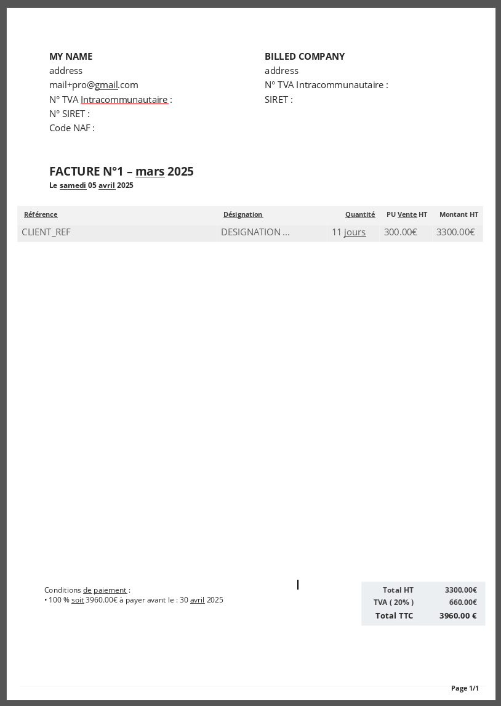

# DOCX Invoice Templating 📄💼

This Python project provides a simple and customizable way to generate invoices using DOCX templates. It allows users to create professional-looking invoices by populating pre-defined templates with dynamic data.



## Features ✨

- **Customizable Templates**: Use your own DOCX templates to create invoices.
- **Dynamic Data Insertion**: Easily insert data such as invoice numbers, dates, client information, and line items.

## Installation 🛠️

To get started, clone the repository and install `python 3.X🐍`:

```bash
git clone https://github.com/yourusername/docx-invoice-templating.git
cd docx-invoice-templating
pip install pipenv
pipenv install
```

## Usage 📚

- Create a Template: Design your invoice template using a word processor like [only office](https://www.onlyoffice.com/download-desktop.aspx) and save it as a DOCX file. Use placeholders (e.g., {{invoice_number}}, {{client_name}}) to mark where dynamic data should be inserted.

- Fill your monthly information into `me.json`

- Generate an Invoice:
```bash
 pipenv run python fillInvoice.py
```

## License 📜

This project is licensed under the MIT License.